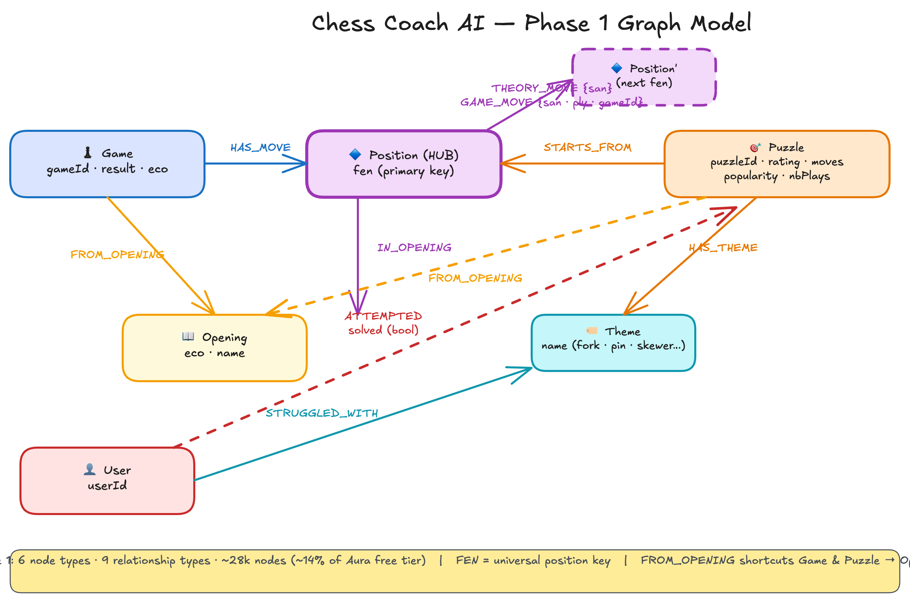

# Chess Coaching Graph

A companion project for [Chess Masti](https://github.com/AayanHetam/chess-coach-ai) that demonstrates how a Neo4j graph database can connect chess positions, puzzles, and games to power adaptive coaching features. It includes a working data pipeline, instructions for creating a Neo4j instance with sample queries, and a set of improvement recommendations with reference implementations.

## Overview

This project has two parts:

1. **Data Pipeline** — Download chess games from Lichess and load them, along with openings and puzzles, into a Neo4j graph database.
2. **Recommendations** — Improvement suggestions for Chess Masti, with five working reference implementations.

## Graph Model

> This diagram was created with [Excalidraw](https://excalidraw.com/) ([source file](simplified-chess-graph.excalidraw)). AI models work well with Excalidraw's JSON format, making it a good choice for iterating on data model diagrams through conversation.

Six node types and nine relationships, with Position at the center as a shared hub. Games replay through positions move by move, puzzles start from specific board states, and openings catalog theoretical move sequences. Because every dataset connects through shared Position nodes, a single Cypher query can traverse from a user's weaknesses to recommended puzzles without joining across tables: User -> STRUGGLED_WITH -> Theme <- HAS_THEME <- Puzzle.

The full graph contains approximately 28,000 nodes and 37,000 relationships, well within the Neo4j Aura free tier. See [ARCHITECTURE.md](ARCHITECTURE.md) for a complete walkthrough of each node type, each relationship, and the design decisions behind the model.

## Part 1: Loading Data into Neo4j

### Setup

This project requires Python and uses [uv](https://docs.astral.sh/uv/) for dependency management. If you do not have Python or uv installed, see [guide_python_uv.md](guide_python_uv.md) for step-by-step instructions on macOS and Windows.

### Download Lichess Games

See [chess-graph/lichess_api_downloader/README.md](chess-graph/lichess_api_downloader/README.md) for full setup, configuration, and the probe command.

The downloader collects Italian Game (C50-C59) games from Lichess as NDJSON. It can run without an API token (sources game IDs from puzzles on HuggingFace) or with a free Lichess token (walks the Opening Explorer for broader coverage). Using the Lichess API with a token is preferred because it provides richer data including clock times, evaluations, and a wider variety of games.

### Load Data into Neo4j

See [chess-graph/data_loading/README.md](chess-graph/data_loading/README.md) for Neo4j Aura setup, what gets loaded (~28,000 nodes across 6 label types), configuration, and 13 sample queries you can paste directly into the Aura console.

The data loader creates a graph of openings, puzzles, games, and seed users in a Neo4j Aura Free Tier instance. It reads from three local sources: the [lichess-org/chess-openings](https://github.com/lichess-org/chess-openings) ECO dataset, the bundled puzzle JSONs from chess-coach-ai, and the games NDJSON from step 1.

The README also includes 15 sample Cypher queries with tutorials explaining how each query works and the steps it takes to traverse the graph. These progress from basic schema inspection to the full adaptive puzzle recommendation query, and can be pasted directly into the Aura console.

### Integration into Chess Masti

See [vercel_api.md](vercel_api.md) for a step-by-step guide to connecting Chess Masti to the Neo4j graph. Chess Masti runs on Vercel as a Next.js application and already has App Router API routes (`src/app/api/`) that run as serverless functions. The guide covers why Neo4j credentials cannot be exposed to the browser (unlike Firebase, Neo4j has no client-side security rules), how to add read-only Neo4j route handlers that follow the project's existing patterns, and how to keep all graph writes in the Python data pipeline for data consistency.

## Part 2: Recommendations

[RECOMMENDATIONS.md](RECOMMENDATIONS.md) contains improvement suggestions for Chess Masti, starting with what the project already gets right and then covering 11 areas for improvement. Five of the recommendations include working reference implementations in the `chess-graph/` directory:

| Recommendation | Sample Code | What It Contains |
|---|---|---|
| 2. Extract openings into structured JSON | `chess-graph/suggested-openings/` | `openings.json` with 3,401 openings (ECO codes, FEN, PGN) and a Firestore service module |
| 3. Unify the three opening systems | `chess-graph/suggested-unified-opening-systems/` | A trie-based opening detector using all 3,219 PGN-equipped openings, plus enriched repertoire lookups |
| 4. Introduce structured logging | `chess-graph/sample-logging/` | A zero-dependency structured logger, AsyncLocalStorage request context, Sentry breadcrumb bridge, and before/after route examples |
| 5. Validate API inputs at the boundary | `chess-graph/sample-validation/` | Zod schemas for 6 API routes with shared field validators, and before/after route examples |
| 6. Add React error boundaries | `chess-graph/sample-error-boundaries/` | A reusable `ErrorBoundary` component with Sentry tagging, and placement examples for the analysis and practice pages |

The remaining recommendations (1, 7-11) are described in the document without separate sample code.
